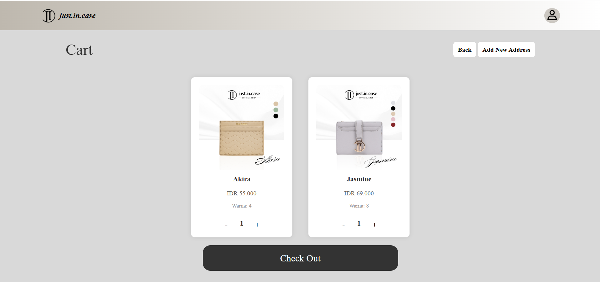

# Website JIC (Just In Case)

**JIC** adalah sebuah platform **e-commerce** yang dibangun menggunakan **Laravel framework**. Website ini dirancang untuk mendukung fitur **RESTful API**, sehingga memudahkan integrasi dengan aplikasi pihak ketiga dan mendukung pengalaman pengguna yang lebih baik.

---

## Fitur Utama

- **E-commerce Platform**: Menyediakan berbagai produk dengan sistem yang mudah digunakan.
- **RESTful API**: Memungkinkan integrasi dengan sistem lainnya untuk efisiensi dan fleksibilitas.
- **Admin Panel**: Mengelola produk, kategori, pesanan, dan pengguna secara terpusat.
- **User-friendly Interface**: Desain responsif yang nyaman digunakan pada perangkat apapun, baik desktop maupun mobile.

---

## Tampilan Website

Berikut adalah beberapa tampilan utama dari website JIC:

### 1. **Home Page**

Halaman utama yang menampilkan berbagai produk unggulan, promosi, dan informasi terkini.

---

### 2. **Catalog Page**

Halaman katalog yang memuat daftar produk berdasarkan kategori, dilengkapi dengan fitur pencarian dan filter.

---

### 3. **Cart & Checkout**

Halaman keranjang belanja dan proses checkout, memberikan pengalaman pembelian yang mudah dan cepat.

---

Website JIC dirancang untuk memberikan kemudahan, kecepatan, dan kenyamanan bagi pengguna dalam berbelanja online.

